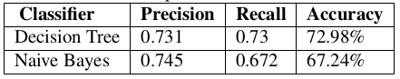

# Human-Pose-Detection

## Objective

According to [NCRB](https://www.financialexpress.com/india-news/crimes-in-india-rise-in-2018-as-compared-to-last-year-murder-rapes-see-a-spike-says-this-report/1080222/), 2.97 million cases of crime recorded in year 2018. The project propose a solution for remote monitoring and analysis, suitable an aerial vehicle - Suspicious activity detection through video analysis, primarily for human pose detection using visual features.

### Project information
* Every activity has a particular pose associated with it.
* Total 4 activities are consider for the scope of this work:
    1. Slap
    2. Kick 
    3. Shoot
    4. Normal
* A comparative analysis of existing classifier to suite the data set.

## Code Execution Instructions

### Command to download large files
```
git lfs fetch --all
```

### Requirements
```
Python (ver >= 3.4)
Numpy
Sklearn
OpenCv
```

### Steps
* Orientation Extraction on Images
```
python OpenPoseImage.py
```
* Training (Results stored in 'orient_train.csv')
```
python multi-person-train.py
```
* Classification on video (sample video: 'etc/d_fight.mp4') - Using Dtree/ KNN classifiers
```
python multi-person-classify_video_dtree.py -v video_path
```
```
python multi-person-classify_video_knn.py -v video_path
```
* Testing (Results stored in 'orient_test_result.csv')
```
python multi-person-classify_test_knn.py
```


## Process Flow


### Pose Estimation
* Z. Cao has proposed mutli-person pose estimation with using CNN
* Two branches - One for body part location and other for affinity between them.

### Orientation Extraction
* Angle with 13 major pairs of body is considered such as Shoulder to Elbow and so on.
* Angles are inverted and w.r.t to horizontal axis.

### Classification
* Simple classification algorithms such as KNN, Decision Tree and Naive Bayes can be trained and used for classification.


## Analysis of Classification Techniques
* Performance of classifier of great importance
* Cross-validation is used for better evaluation of classifiers.


## Results

### Output of the proposed method


### Pre-processing of Data
* Due to obstruction in the scenario many body parts will not get covered.
* A weak assumption that those body parts are vertically straight is made.(highlighted by yellow color)


### Data set Statistics


## Comparative Analysis results

### KNN


#### More


* For further analysis KNN & DTree are selected

### Video Demonstration 
[KNN (individual frames)](https://www.youtube.com/watch?v=QPX6EfMV6Yg)


Click [here](https://drive.google.com/file/d/1mY7mQrSCch27qUGwuCd01hNSazhXU8OE/view?usp=sharing) to go the detailed report.